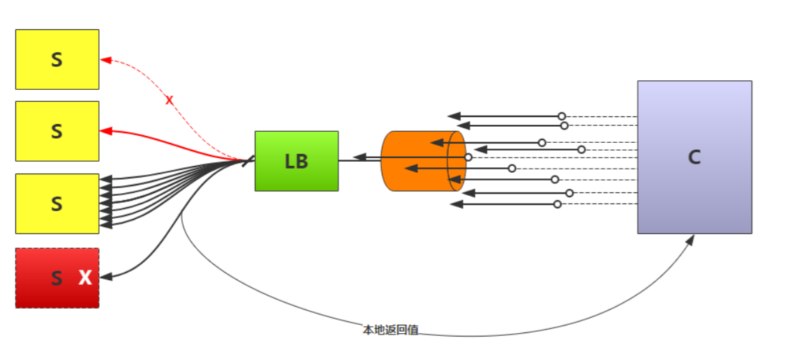
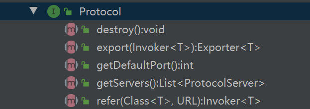
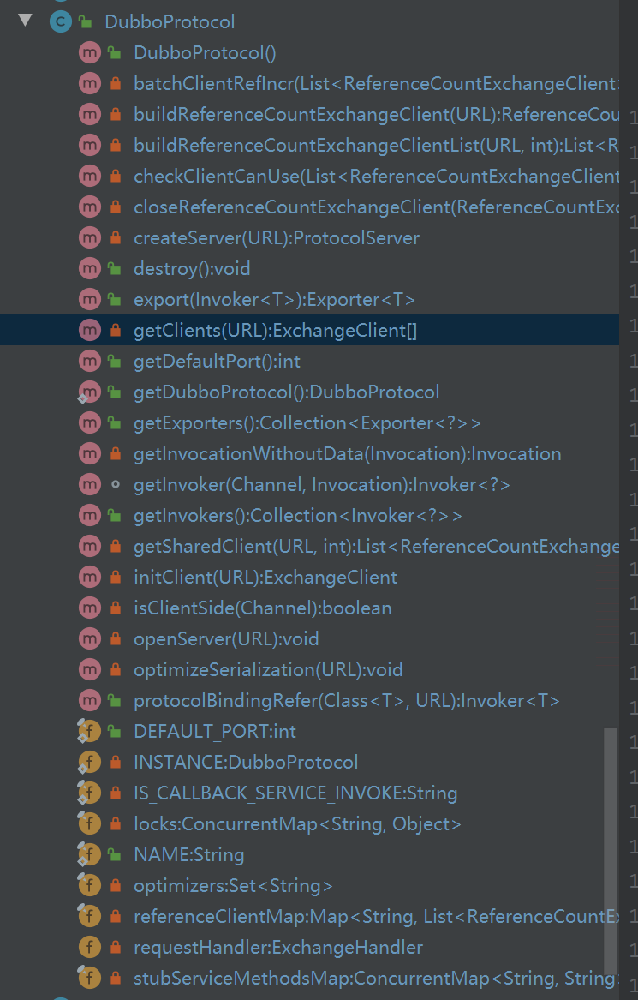
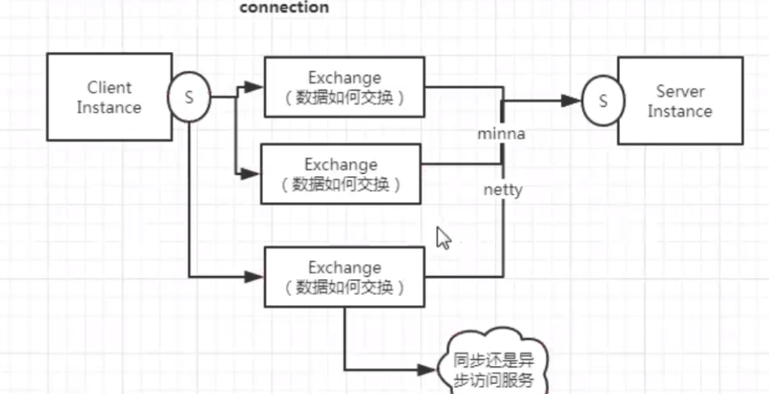
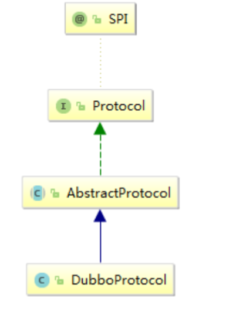
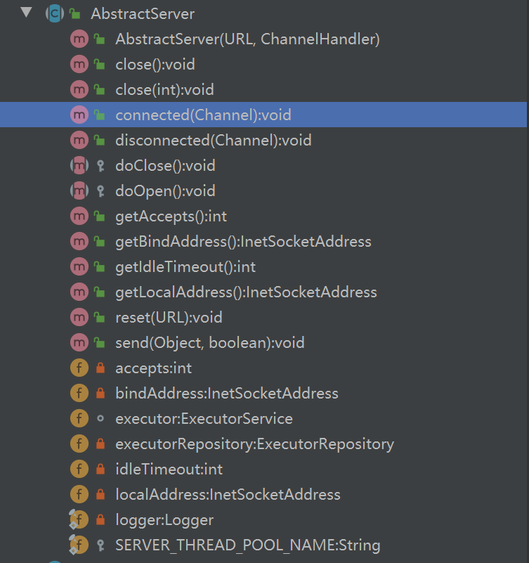
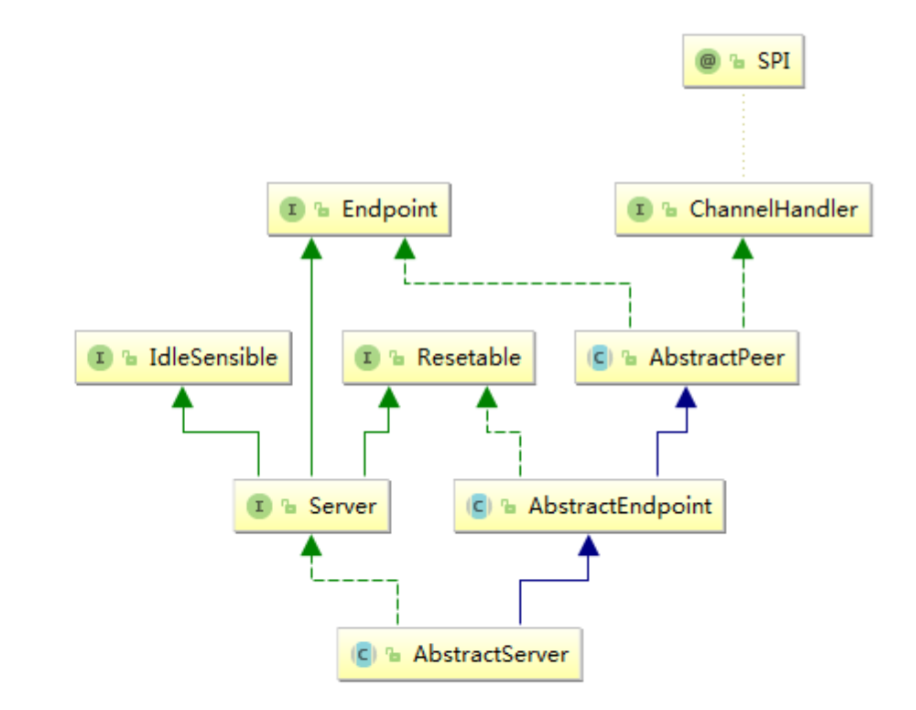

# 基本概念解释

## 几个问题

什么场景使用服务限流？ 

容错机制为服务提供了什么保障？

啥业务场景适合服务降级？

服务限流为何而生 ？

服务限流的手段&场景 ？

服务容错机制为服务提供了保障机制手段方式？

服务降级策略与实现？

限流、容错、降级在微服务中实现的思想？


RPC 框架代码的复杂体现在：保持服务的各个环节的高可用（超时，重试）与稳定性



客户端请求，到达网关，网关进行限流，集群容错 ，负载均衡。


## 降级

服务降级属于服务治理（服务管理）的一种。（静态治理或动态治理【监控平台】 或 智能治理【完善的智能化监控平台】）


### 降级的作用

释放资源：比如说在秒杀的场景中，积分服务不是特别重要，释放一点资源，给其他核心服务。

本地伪装（Mock）：当核心服务出现问题的时候，不在返回实时的信息，而返回非实时的缓存信息。比如获取最新的个人信息时，出现错误，返回非实时的缓存信息。


### 降级范围

大颗粒：针对整个服务，小颗粒：针对单个请求


## 容错

容错：集群容错，在一个集群请求过程中发生错误，如何进行有效的规避。


负载均衡

在集群中的服务中选择最佳服务者 ，提高整体服务的吞吐量。  

负载均衡策略

轮询， hash一致，最小连接数 


### 容错VS熔断

熔断：触发在客户端或者服务端，从系统层面查看负载能力，如果超过最大负荷则快速失败，确保单个服务的最佳高负载，也就是保持最大吞吐量。


服务端统计：服务端进行快速失败

客户端统计：客户端预估（静态配置）服务的负载能力（客户端快速失败【MOCK】）。 


## RPS，TPS，QPS


PV  即 page view，页面浏览量     用户每一次对网站中的每个页面访问均被记录1次。用户对同一页面的多次刷新，访问量累计。

UV 即 Unique visitor，独立访客  通过客户端的cookies实现。即同一页面，客户端多次点击只计算一次，访问量不累计。

IP  即 Internet Protocol，本意本是指网络协议，在数据统计这块指通过ip的访问量。  即同一页面，客户端使用同一个IP访问多次只计算一次，访问量不累计。

TPS 即Transactions Per Second的缩写，每秒处理的事务数目。一个事务是指一个客户机向服务器发送请求然后服务器做出反应的过程。客户机在发送请求时开始计时，收到服务器响应后结束计时，以此来计算使用的时间和完成的事务个数，最终利用这些信息作出的评估分。

QPS 即Queries Per Second的缩写，每秒能处理查询数目。是一台服务器每秒能够相应的查询次数，是对一个特定的查询服务器在规定时间内所处理流量多少的衡量标准。

RPS  即Requests Per Second的缩写，每秒能处理的请求数目。等效于QPS

响应时间(RT) 响应时间是指系统对请求作出响应的时间。 

吞吐量(Throughput) 吞吐量是指系统在单位时间内处理请求的数量。 

50RPS-51RPS => 48TPS  ，由于多于50一点数据，导致整体TPS大量降低。

系统负载查看KPI指标：  

- CPU占比 

- MEM占比 

- NET占比 

- Thread占比

- JVM 容器占比 

以上数据可以通过**链路压测**获得


## 限流

限流指标：指当前服务最佳负载流量指标RPS(Request per second)

限流可以通过以下几个方式来限制：

- 客户端的请求连接数
- 服务端最大的TCP连接数 
- 业务的最大线程数


### 连接请求数与线程数之间的差距

1、连接请求数：在指定的时间(Timeout)之内返回数据的情况下，服务端可以接受的请求数量。

比如100请求过来，并发处理的请求数量为50个，且超时时间设置为0。

没有超时时间就是死等，死等造成的最严重的的后果是，线程资源被消耗尽。最终结果JVM内存溢出，超时占用内存无法释放，服务雪崩 。但是如果时间设太短，又会导致异常。


2、线程数，当服务超过最大的线程处理资源之后直接拒绝，返回错误异常。

制定线程池属性，指定BlockQueue等待队列大小，存放请求业务。

 


### 服务限流和熔断

限流和熔断是处理并发的两大利器

客户端熔断

服务端、客户端限流

**dubbo的熔断是在客户端**

服务限流的最终结果处理为：本地伪装 （Dubbo）


### 限流的主要作用


限流主要作用：保护应用，防止因重试与超时积压导致服务的雪崩。每个应用都有自己处理请求的上限，一旦应用承受过多请求，会对正在处理中的请求造成影响，如果更严重，对上下游也会造成雪崩效应。


同时对客户端和服务端进行限流。


### 客户端限流

- 信号量限流 ：通过统计连接的方式进行限流，当超过连接数时，返回异常，此时连接已经建立了，进入了业务层。 sign kill 2123 os send sign to program ,程序被杀之前存储最终数据 ，防止数据的不一致性，类似服务端优雅停机。
- 连接数限流 ：通过s底层ocket连接来阻止更多的请求到达业务层，这样限流比较绝对，导致在客户端请求直接被丢弃，服务端无法实现请求在最大等待时间内稍后返回。

客户端有重试机制

### 服务端限流

- 线程池限流 (隔离手段)    线程太多了，时间片切换太多，任务处理效率降低

- 信号量限流 (非隔离手段) 
- 接收数限流 (socket->tcp)


> 时间片：每个线程占用CPU服务的时间范围。


客户端和服务端为什么要同时进行限流？


### Dubbo客户端连接数限流如何实现？

dubbo客户端限流实现：TCP限流


org.apache.dubbo.rpc.Protocol



```java
int getDefaultPort();   //服务端口

//服务发布流程方法 
<T> Exporter<T> export(Invoker<T> invoker) throws RpcException; 

//发布引用流程方法 
<T> Invoker<T> refer(Class<T> type, URL url) throws RpcException;

void destroy();
```

Refer方法通过控制Exchanger数量的方式来达到连通方式控制。


org.apache.dubbo.rpc.protocol.dubbo.DubboProtocol




```java
public <T> Invoker<T> protocolBindingRefer(Class<T> serviceType, URL url) 

private ExchangeClient[] getClients(URL url) 

private ExchangeClient initClient(URL url) 
```


单个接口服务的链接数量，也就是独享链接数量

多个接口服务共享的链接数量







### Dubbo服务端连接数限流如何处理？


org.apache.dubbo.remoting.transport.AbstractServer







RpcStatus 统计的两个维度 ： 方法级别的 methodStatus     应用级别的 appStatus


### dubbo客户端线程方式限流如何实现？ 


TpsLimitFilter（TPS:每秒事务请求数） 

ExecuteLimitFilter 【服务端】

ActiveLimitFilter 【客户端】


dubbo：sentinel 哨兵，服务治理框架


## TPS核心原理算法

在固定的时间内，减去设置的阀值数，如果为0 则直接拒绝操作，反之则进行业务操作

 

```java
//当前操作时间 
long now = System.currentTimeMillis(); //当前操作时间大于创建时间+间隔（多少S） 
if (now > lastResetTime + interval) { 
    token.set(rate); 
    lastResetTime = now;
} 

TPS=> 5 /S 
TPS=> 100 /S 
TPS=> 10000/S
    
10000 //后去频率值 
    
int value = token.get(); //初始标记为失败 
boolean flag = false; 

while (value > 0 && !flag) { 
    flag = token.compareAndSet(value, value - 1); 
    value = token.get();
}
return flag
    
```


