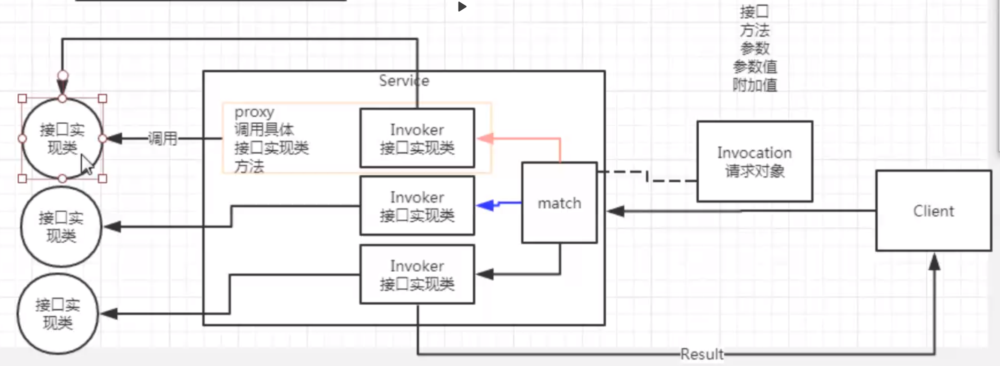
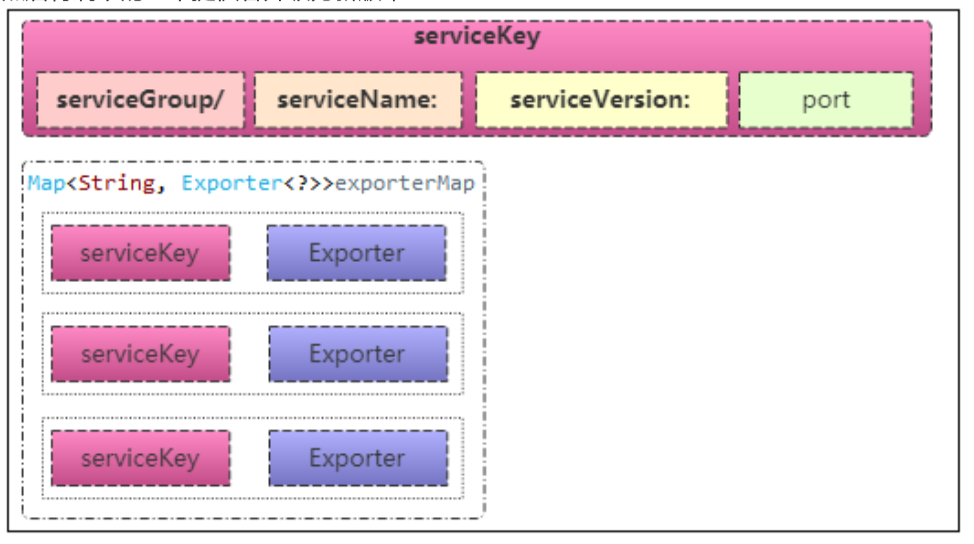
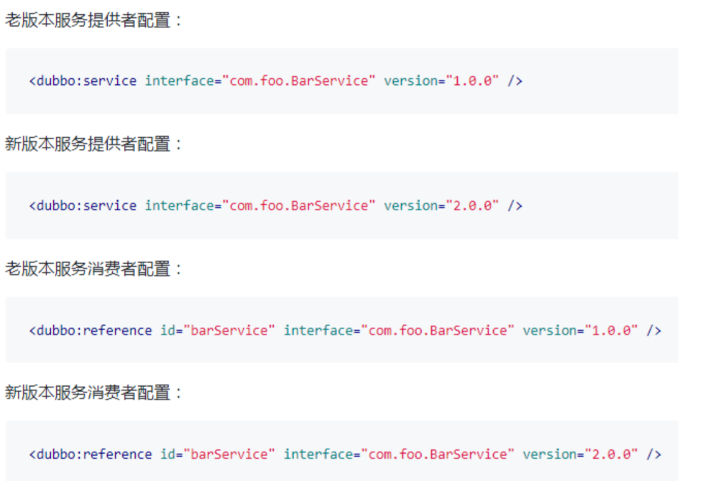

## 几个问题

服务延迟暴露：

为什么需要延迟暴露，跟warmup有啥关系？ 

服务结果缓存：为什么需要缓存，是否所有的方法都能缓存？   高并发三大利器之一

服务多版本控制：多版本背后本质的作用是什么？

服务多注册中心：多注册什么业务场景使用？  服务集群对等


1. 了解延迟暴露使用场景 
2. 了解延迟暴露背后的本质原理 
3. 结果缓存作用的环节
4. 结果缓存内容有哪些 
5. 多版本库控制如何在业务中使用 
6. 多版本底层是如何实现的 
7. 多注册中心实现方式
8. 多注册中心的实现原理


## 延迟暴露  （预热）

如果你的服务需要预热时间，比如初始化缓存，等待相关资源就位等，可以使用 delay 进行延迟暴露。 


1、服务刚刚启动之后的服务能否提供最佳的服务时间点。 

例如weblogix比较慢。

ip+端口+接口+参数 : 存入注册中心,consumer就会立即得到通知,

consumer如果开始远程访问，由于应用还没有准备好，可能会导致没必要的超时或者错误返回。


retry 频率就高，级联操作越多，负载能力降低，雪崩，导致一启动项目就导致服务死了。


2、服务启动之后首选需要将服务注册到注册中心

```java
public synchronized void export() { 
  //检测服务配置是否合理 
  checkAndUpdateSubConfigs(); 
  //是否将服务进行发布 
  if (!shouldExport()) { 
     return;
  } 
  //是否延迟发布 
  if (shouldDelay()) { 
  //延迟发布 
  delayExportExecutor.schedule(this::doExport, delay, TimeUnit.MILLISECONDS); 
  } else { 
  //及时发布 
  doExport();
  }
}
```

服务暴露级别在于接口级别 不在 服务（整个项目是不对的）级别 

dubbo ://path(包名+接口类) ZK node 


通过接口访问 

UserService users = 代理过程

users.getUsers();


org.apache.dubbo.config.service.ServiceConfig

每一个\<dubbo:service>   对应一个ServiceConfig  ，在标签里通过 delay来控制延迟暴露。

将一个服务暴露的工作添加到一个定时任务中，时间到达时执行任务，开始提供服务。

新版本中加入了CompletableFuture。

旧版本是直接丢到ScheduledExecutorService任务中


在dubbo新版本中将原有的配置管理从注册中心中拆解出来，组建一个配置中心新模块来管理，来应对越来越大的集群管理。

但是拆开了也不是很好，因为你要连接两个模块。


Protocol  的子类 registerProtocol 伪协议，起到了中转的目的。path定位到哪个资源 

registerProtocol     dubboProtocol


ApplicationModel.initApplication();//qos监控   服务质量控制

BootstrapUtils

DubboBootstrap


\<dubbo:registry> contextpath应用程序上下文 进行维度划分，一般不设置

\<dubbo:model> 模块 

\<dubbo:provider> 里面可以写\<dubbo:service>里公共的配置


isGeneric()泛化调用

injvm 暴露在本地

dynamic 人工发布，动态发布，静态发布

poxy 代理模式

invoker 接口实现类  invocation参数包含




发布服务的时候，会缓存发布的服务。

本地存根

参数回调


## 结果缓存

结果缓存用于加速热门数据的访问速度，内部提供了缓存类型，以减少用户加缓存的工作量 

冷数据： 

热数据： 

温数据：

他们之间数据的迁移方式。


缓存，存储数据在内存中，hit指标就比较重要的了 ，如果hit指标比较低，证明你的缓存设计不友好， 浪费系统资源。

缓存主要的KEY，是方法吗？ 如果是那么这个颗粒度比较大，缓存值的比配错误率就比较高

getUser(Integer userid,......) 

userid=1 张三消息

userid=2 张三消息

org.apache.dubbo.cache.filter.CacheFilter

通过参数达到小的颗粒度


## 缓存策略

LRU 【最近最少使用原则删除多余缓存，保持最热的数据被缓存】 LinkedHashMap 自带，重写removeEldestEntry方法

缺点，计算强度大 

优点：有效控制容器空间，避免空间浪费

org.apache.dubbo.common.utils.LRUCache

org.apache.dubbo.cache.support.expiring.ExpiringCache

org.apache.dubbo.cache.support.expiring.ExpiringMap


expiring 【过期策略，指定过期时间】 redis 自定 key 过期时间

缺点，热度消息会被删除掉 这个完全取决于你对业务数据的把控

如果key值的生命周期比较长，你就可以采用这个


threadLocal 【当前线程缓存，比如一个页面渲染，用到很多 portal，每个 portal 都要去查用户 信息，通过线程缓存，可以减少这种多余访问】

细颗粒控制数据的维度限制在一个业务请求周期内，不会超过其他线程数据范围。

减少资源锁定的时间


jcache 【可以桥接各种缓存实现】

跨JVM，属于内存共享区

javax.cache.Cache;


## 多版本控制 

当一个接口实现，出现不兼容升级时，可以用版本号过渡，版本号不同的服务相互间不引用。 

可以按照以下的步骤进行版本迁移：

- 在低压力时间段，先升级一半提供者为新版本
- 再将所有消费者升级为新版本
- 然后将剩下的一半提供者升级为新版本


多版本案例

例如在不同地区下的优惠力度不一样，可以用servicegroup进行区分，默认版本是1.0.0






## 多注册中心


```xml

<?xml version="1.0" encoding="UTF-8"?> <beans xmlns="http://www.springframework.org/schema/beans" xmlns:xsi="http://www.w3.org/2001/XMLSchema-instance" xmlns:dubbo="http://dubbo.apache.org/schema/dubbo" xsi:schemaLocation="http://www.springframework.org/schema/beans http://www.springframework.org/schema/beans/spring-beans-4.3.xsd http://dubbo.apache.org/schema/dubbo http://dubbo.apache.org/schema/dubbo/dubbo.xsd"> <dubbo:application name="world" /> <!-- 多注册中心配置 --> 
<dubbo:registry id="hangzhouRegistry" address="10.20.141.150:9090" /> 
<dubbo:registry id="qingdaoRegistry" address="10.20.141.151:9010" default="false" /> <dubbo:protocol id="d1" name="dubbo" address=""></dubbo:protocol>
<dubbo:protocol id="h1" name="http2"></dubbo:protocol> 
    <!-- 向多个注册中心注册 --> 
<dubbo:service interface="com.alibaba.hello.api.HelloService" version="1.0.0" ref="helloService" registry="hangzhouRegistry,qingdaoRegistry" protocol="d1,h1" protocol="dubbo" cache="lru" jcache="ecache"> 
<dubbo:method name="say" cache=""
</dubbo:service>
</beans>
```


```xml
<?xml version="1.0" encoding="UTF-8"?> <beans xmlns="http://www.springframework.org/schema/beans" xmlns:xsi="http://www.w3.org/2001/XMLSchema-instance"
xmlns:dubbo="http://dubbo.apache.org/schema/dubbo"xsi:schemaLocation="http://www.springframework.org/schema/beanshttp://www.springframework.org/schema/beans/spring-beans-4.3.xsd http://dubbo.apache.org/schema/dubbo http://dubbo.apache.org/schema/dubbo/dubbo.xsd">
    
<dubbo:application name="world" /> 
    <!-- 多注册中心配置 --> 
<dubbo:registry id="chinaRegistry" address="10.20.141.150:9090"/> 
<dubbo:registry id="intlRegistry" address="10.20.154.177:9010"default="false" /> 
    <!-- 引用中文站服务 --> 
<dubbo:reference id="chinaHelloService"
interface="com.alibaba.hello.api.HelloService" version="1.0.0" registry="chinaRegistry,intlRegistry" /> 
    <!-- 引用国际站站服务 --> 
<dubbo:reference id="intlHelloService"
interface="com.alibaba.hello.api.HelloService" version="1.0.0" registry="intlRegistry" />
    
</beans>
```


多注册中心dubbo实现原理

客户端多注册中心引用

服务端多注册中心提供