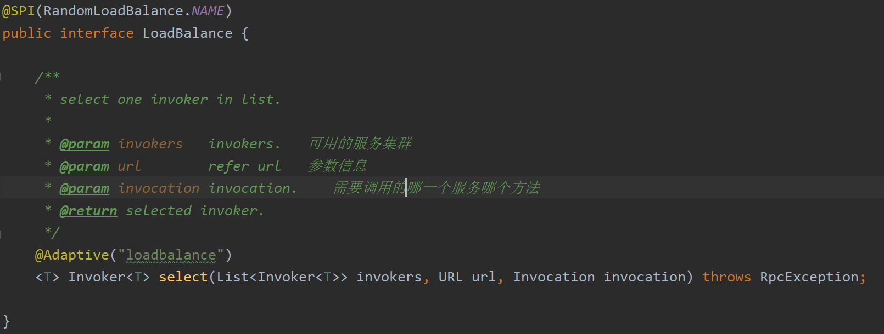
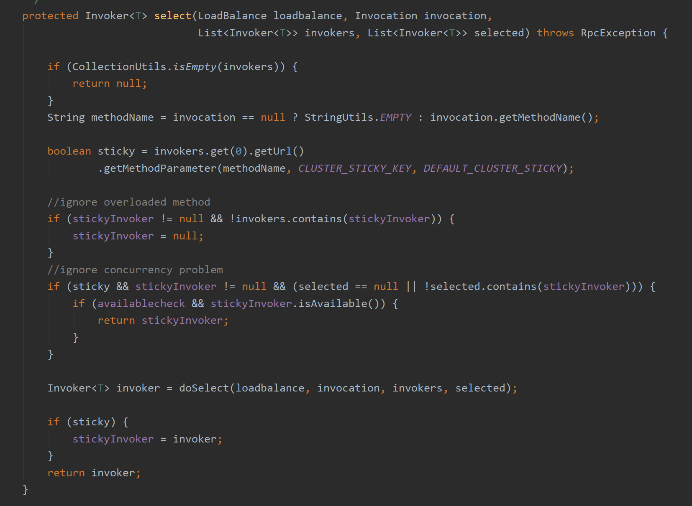

## 几个问题


负载均衡在什么场景中会被使用？ 

负载均衡为什么需要提供了不同的策略，作用是什么？

 什么业务情况下仅订阅？ 

什么业务场景下紧注册？

为什么需要异步调用与同步调用的差距在什么地方？


## 负载均衡种类

DNS负载均衡，网关负载均衡，域名的负载均衡，业务调用的负载均衡，硬件负载均衡。


## 负载均衡作用

分摊流量，提高响应速度，消除单点故障，探知负载压力


## 负载均衡配置

负载均衡只有在客户端。服务端没有。虽然配置里都有。

```xml
<!--服务端服务级别-->
<dubbo:service interface="..." loadbalance="roundrobin" />

<!--客户端服务级别-->
<dubbo:reference interface="..." loadbalance="roundrobin" />

<!--服务端方法级别-->
<dubbo:service interface="...">
	<dubbo:method name="..." loadbalance="roundrobin"/>
</dubbo:service>

<!--客户端方法级别-->
<dubbo:reference interface="...">
	<dubbo:method name="..." loadbalance="roundrobin"/>
</dubbo:reference>
```


## 负载均衡核心接口

org.apache.dubbo.rpc.cluster.LoadBalance





org.apache.dubbo.rpc.cluster.support.AbstractClusterInvoker

从下面的代码可以看到负载均衡和集群容错紧密集合，通过集群容错调用负载均衡




## 负载均衡策略

org.apache.dubbo.rpc.cluster.loadbalance.RoundRobinLoadBalance    轮询负载均衡

org.apache.dubbo.rpc.cluster.loadbalance.RandomLoadBalance   随机负载均衡

org.apache.dubbo.rpc.cluster.loadbalance.LeastActiveLoadBalance   最小链接数负载均衡

org.apache.dubbo.rpc.cluster.loadbalance.ConsistentHashLoadBalance   hash一致性负载均衡


负载均衡父类

org.apache.dubbo.rpc.cluster.loadbalance.AbstractLoadBalance   默认权重100


```java
     @param uptime the uptime in milliseconds   当前服务运行的时间
     @param warmup the warmup time in milliseconds   预热的时间
     @param weight the weight of an invoker    权重    
    static int calculateWarmupWeight(int uptime, int warmup, int weight) {
        int ww = (int) ( uptime / ((float) warmup / weight));
        return ww < 1 ? 1 : (Math.min(ww, weight));
    }
```


应用启动预热时间越长，他的性能就会越高，权重越大。权重是不断变化的。


